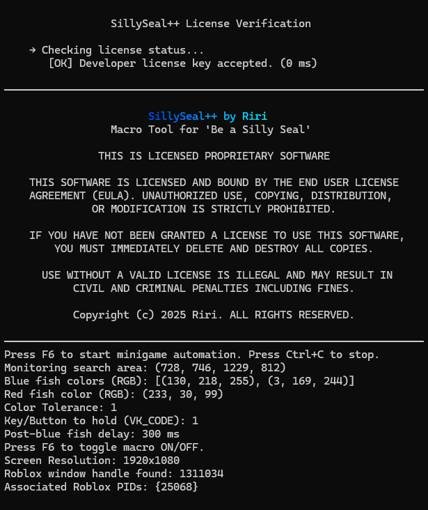
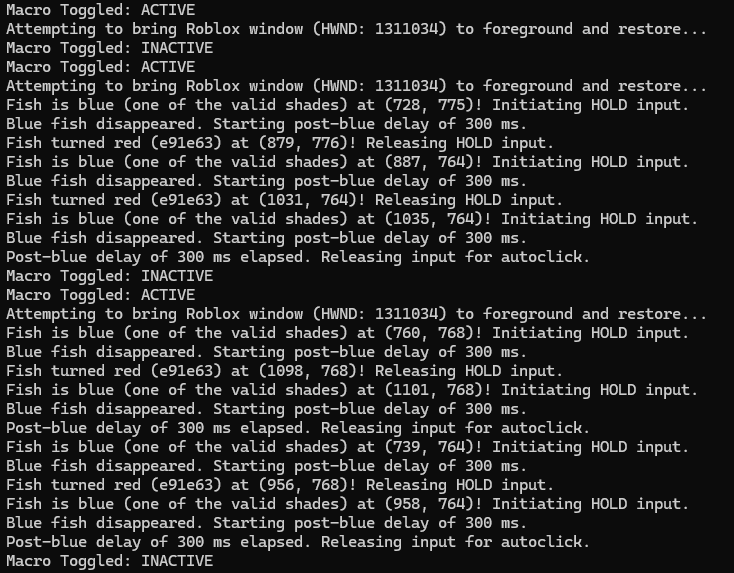
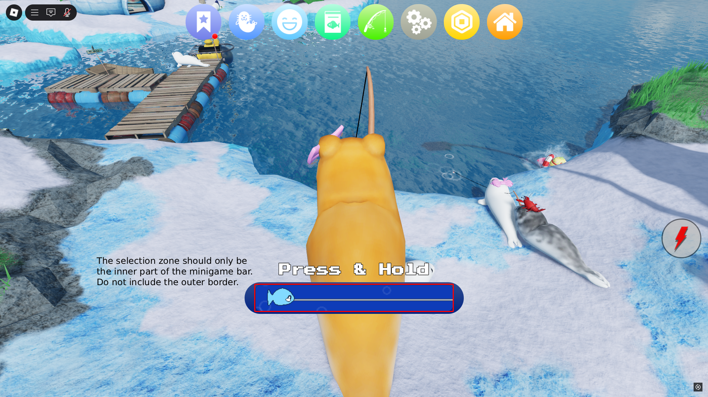

<div align="center">

  <h1>SillySeal++™ by Riri</h1>
  <h2>The Ultimate Fishing Macro for Be a Silly Seal</h2>

</div>

> This repository contains documentation for SillySeal++™, a proprietary fishing macro for Be a Silly Seal.
Purchase the full software at Gumroad.

**Tired of missing fish? Let SillySeal++™ fish for you.**

SillySeal++ is a **high-performance macro tool** built exclusively for the Roblox game [*Be a Silly Seal*](https://www.roblox.com/games/71816718496622). Designed by Riri, this precision-crafted software automates the fishing minigame with frame-perfect accuracy using real-time pixel color detection — so you can focus on collecting, upgrading, and being the silliest seal you can be.

<div align="center">

<br>

[](https://angelicwu.gumroad.com/l/SillySealPlusPlus)  
**Get instant access and license key delivery.**

<br>

[](https://github.com/AlinaWan/SillySealPlusPlus)  
**Official documentation and setup instructions.**

<br>

</div>


> [!WARNING]
> **The only official SillySeal++™ websites are the GitHub repository and the Gumroad page linked above.**  
Beware of counterfeit copies or unofficial distributions—downloading or purchasing from anywhere else may put your computer or license at risk.

---

## 🎥 Live Demo & Screenshots

<div align="center">

### 🐟 Mythical Fish Catch (Nearly Impossible Without a Macro)


<br>

### 💬 Screenshot: Console Startup


<br>

### 💬 Screenshot: Console Logs


</div>

---

## ⚙️ Features

- Macro automation for the 'Be a Silly Seal' fishing minigame
- Real-time pixel color detection for red and blue fish
- Toggle system (F6) to start/stop macro
- Fast startup and low CPU usage
- Designed for 1920x1080 screen resolution (customizable)

---

## 🖥️ Installation

1. Download and unzip the software package.
2. Place the folder anywhere on your PC.
3. Double-click the SillySeal++ file to launch it.

---

## 🔑 How to Get Your License Key

After purchasing SillySeal++ on Gumroad, you can find your license key:

* On the **post-checkout confirmation page**, immediately after completing your purchase.
* In your **Gumroad Library** under your account at [https://gumroad.com/library](https://gumroad.com/library).

The license key is a unique string required to activate SillySeal++. You will be prompted to enter or paste this key when running the program for the first time.

> [!WARNING]
> Your license key is unique and tied to your purchase. It must not be shared, resold, or distributed to others. Sharing your license key violates the terms of the EULA (End User License Agreement) and may result in termination of your access or legal action.

---

## 🧠 IMPORTANT: How to Set Up The Macro

### Scan Area

SillySeal++ detects fish in a specific rectangular screen region where the fishing minigame occurs.

To set it up correctly:
1. **Open Be a Silly Seal in Roblox** and start the fishing minigame.
2. **Use your screen snipping tool** or reference your resolution (1920x1080 by default).
3. **Adjust the detection area values in the `bar_area.ini` file**, which is automatically created the first time you run the app with default settings based on a 1920x1080 windowed setup on Windows 11 (100% scale).

The default `bar_area.ini` will look like this:
```ini
[DetectionArea]
left = 728
top = 746
right = 1229
bottom = 812
````
If your game window or resolution differs, modify these values accordingly to ensure accurate fish detection. The scan area values should match the highlighted area in the following image example:  


### Color Detection

If the macro **fails to detect fish**, or **detects incorrect objects** (like the red bar at the left of the minigame), you may need to **adjust the color tolerance** setting.

Open the `bar_area.ini` file and locate this value:

```ini
[Settings]
color_tolerance = 1
```

* 🔼 **Increase this number** (e.g. `2`, `5`, or `8`) if **fish aren’t being detected**. This allows more flexibility when matching fish colors that may appear slightly different due to lighting or screen effects.
* 🔽 **Decrease this number** (e.g. `0` or `1`) if the macro is **detecting non-fish objects**. This makes the detection stricter, only allowing near-exact color matches.

> Setting the tolerance too high may cause the macro to click on incorrect targets.

---

## ⌨️ Usage

* Hover your mouse over the fishing prompt.
* Press <kbd>F6</kbd> to start or stop the macro.
* The macro will auto-detect red/blue fish and do the clicking for you.
* To exit manually, press <kbd>Ctrl</kbd> + <kbd>C</kbd> in the console window.

---

## ❗ Licensing

SillySeal++ is a **proprietary** macro tool. You must have a valid license key to run the software. Unauthorized distribution or tampering may result in legal action.

### License Terms:

* Non-commercial only
* No redistribution
* No modification or reverse engineering
* You may not share, resell, or leak this software

Full license terms are available in the [EULA](EULA.md).

---

## 📜 Disclaimer

SillySeal++™ is distributed **as-is** with **no guaranteed support**. This software is not affiliated with Roblox Corporation or the creators of *Be a Silly Seal*. Use at your own risk. Macro usage in online games may violate terms of service.

---

SillySeal++™ is a trademark of Riri and protected under copyright and common law.

© 2025 Riri. All rights reserved.
